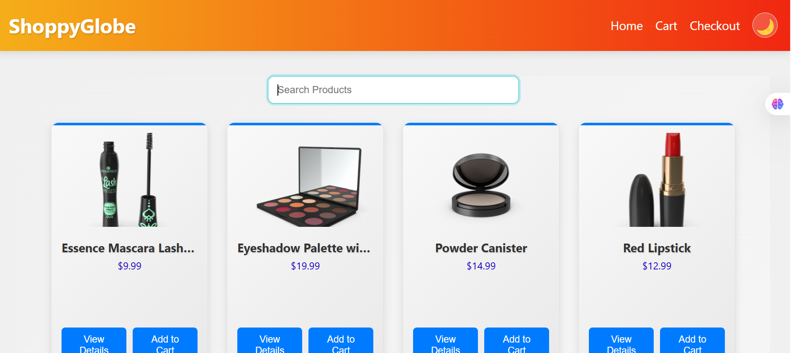
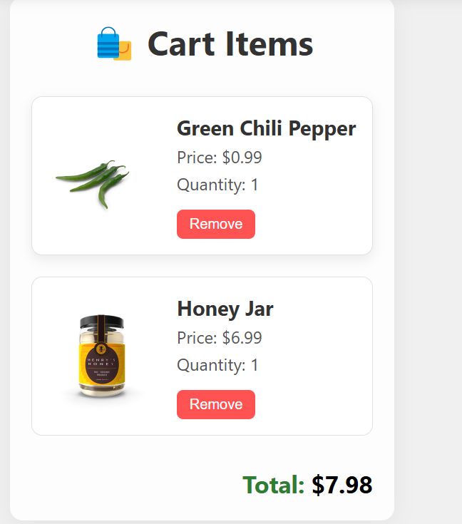
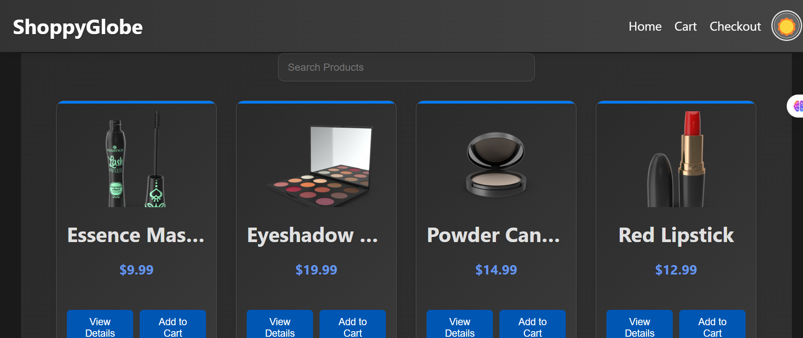
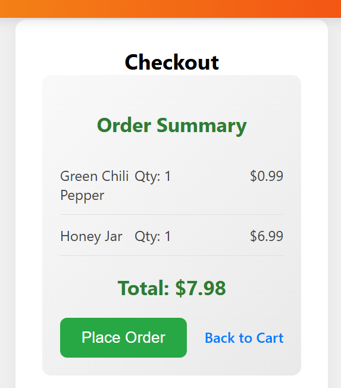

# 🛒 ShoppyGlobe – React E-commerce Application

ShoppyGlobe is a fully functional, responsive e-commerce web application built using **React**, **Redux**, and **React Router**. It features product browsing, detailed product views, a shopping cart, and checkout functionality — all built with modular, reusable components and modern best practices like **lazy loading**, **custom hooks**, and **dark mode** support.

---

## 🚀 Features

- ⚛️ React functional components with `useState`, `useEffect`, and `useReducer`
- 🛍️ Product listing and detailed product view using external API
- 🛒 Cart functionality powered by **Redux Toolkit** (add/remove items)
- 🔍 Search filter for products
- 🌗 Dark/Light mode toggle
- 🌐 Routing with React Router v6
- 🐢 Code-splitting with `React.lazy` and `Suspense`
- 🛠 Custom hook for data fetching
- ⚠️ Graceful error handling for API calls
- 📱 Responsive design with CSS
- 🚫 404 Not Found route

---

## 🗂️ Project Structure

```
src/
├── Main.jsx
├── App.jsx
├── App.css
├── index.js
│
├── Components/
│   ├── Header.jsx
│   ├── Footer.jsx
│   ├── ProductList.jsx
│   ├── ProductItem.jsx
│   ├── ProductDetails.jsx
│   ├── Cart.jsx
│   ├── CartItem.jsx
│   ├── Checkout.jsx
│   └── NotFound.jsx
│
└── utils/
    ├── redux/
    │   ├── store.js
    │   ├── cartSlice.js
    │   └── searchSlice.js
    │
    └── hooks/
        └── useFetchProducts.js
```

---

# Live Demo
https://shoppy-globe-e-commerce-webite-jsjs.vercel.app/

## ⚙️ Key Functionality

### 🔁 Routing

Using `react-router-dom`:
- `/` → ProductList
- `/product/:id` → ProductDetail
- `/cart` → Cart
- `/checkout` → Checkout
- `*` → NotFound

### 💤 Lazy Loading

Components like `ProductList`, `ProductDetail`, `Cart`, and `Checkout` are lazy-loaded:
```js
const ProductList = lazy(() => import("./Components/ProductList"));
```

Wrapped inside:
```jsx
<Suspense fallback={<div>Loading...</div>}>
  <Routes>...</Routes>
</Suspense>
```

### 🌓 Dark Mode Toggle

Toggle managed via `useState`:
```js
const [isDarkMode, setIsDarkMode] = useState(false);
document.body.classList.toggle("dark-mode");
```
Handled in the `Header` component using props.

### 🛍️ Redux for Cart State

Redux Toolkit manages cart state:
- Add to cart
- Remove from cart
- Modify quantity
- Selectors for cart total and item count

### 🔧 Custom Hook

Product fetching logic is handled inside:
```
utils/hooks/useFetchProducts.js
```
Used in `ProductList` for cleaner code and reusability.

---

## 🧑‍💻 Getting Started

### 1. Clone the repository

```bash
git clone https://github.com/shubham910566/E-Commerce-App.git
cd vite-project
```

### 2. Install dependencies

```bash
npm install
```

### 3. Run the app

```bash
npm run dev
```

### 4. Run the development server

```bash
npm start
```

---

## 📦 Dependencies

- **React**
- **Redux Toolkit**
- **React Router DOM**

---

## 🌐 API

Fetching products from:
```
https://dummyjson.com/products
```

---

## ✅ Submission Checklist

- [x] Functional and reusable components
- [x] Props used correctly
- [x] API fetching with useEffect
- [x] Custom hook and Redux for state management
- [x] Dark mode & lazy loading implemented
- [x] Responsive design
- [x] Routing & 404 page
- [x] GitHub repo ready with proper structure

---

## 📸 Screenshots

- Product listing

- Product detail view

- Cart with items

- Dark mode toggle

- Checkout flow


---

## ✍️ Author

**Shubham**  
📧 Email: sdhasmana96@gmail.com
🔗 GitHub:https://github.com/shubham910566 

---

## 📄 License

This project is licensed under the [---](LICENSE).

```
